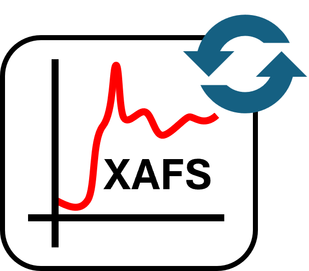

<!--
   Copyright 2019-2022 RO-Crate contributors
   <https://github.com/ResearchObject/ro-crate/graphs/contributors>

   Licensed under the Apache License, Version 2.0 (the "License");
   you may not use this file except in compliance with the License.
   You may obtain a copy of the License at

       http://www.apache.org/licenses/LICENSE-2.0

   Unless required by applicable law or agreed to in writing, software
   distributed under the License is distributed on an "AS IS" BASIS,
   WITHOUT WARRANTIES OR CONDITIONS OF ANY KIND, either express or implied.
   See the License for the specific language governing permissions and
   limitations under the License.
-->

# Reproducible XAFS Analyses

The [Reproducible XAFS Analyses Zenodo community](https://zenodo.org/communities/rexas/records) groups Galaxy RO-Crates containing workflows and data for the reproduction of published papers which contain X-ray absorption fine structure (XAFS) analyses.

As of November 2024, the team has reproduced published results from nine papers in the area of Catalysis. The original analyses were reproduced using X-ray absorption spectroscopy (XAS) Galaxy tools developed by the [Scientific Computing Department](https://www.scd.stfc.ac.uk/Pages/home.aspx) at [STFC](https://www.ukri.org/councils/stfc/), as part of the [PSDI](https://www.psdi.ac.uk) project.

RO-Crates exported from Galaxy have been published to the Zenodo community as part of the research data submitted for the paper: **Use of scientific workflows to support the processing and analysis of catalysis research data from XAFS experiments** (Under review). 

The team will keep on adding more RO-Crates from examples relevant to the catalysis domain. 

Tutorials have also been developed to train researchers in reproducing XAFS analyses using Galaxy and RO-Crate (see resources below).

## Resources

* [Reproducible XAFS Analyses on Zenodo](https://zenodo.org/communities/rexas/records)
* [Tutorial: Importing an RO-Crate into Galaxy](https://xerte.cardiff.ac.uk/play_22519) with an XAFS example

## Keywords 

XAFS reproducibility, Galaxy RO-Crates, Catalyst Characterisation

## Publications

**Use of scientific workflows to support the processing and analysis of catalysis research data from XAFS experiments** (under review, not yet public)
